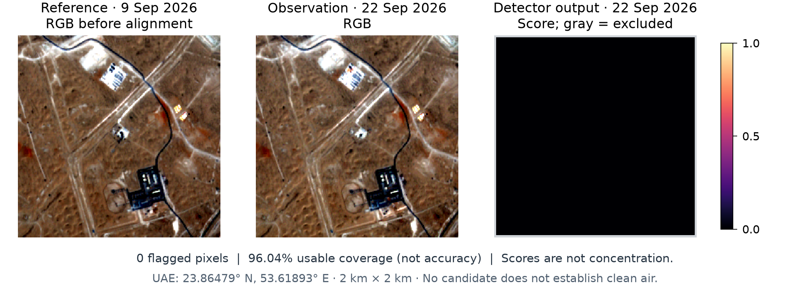
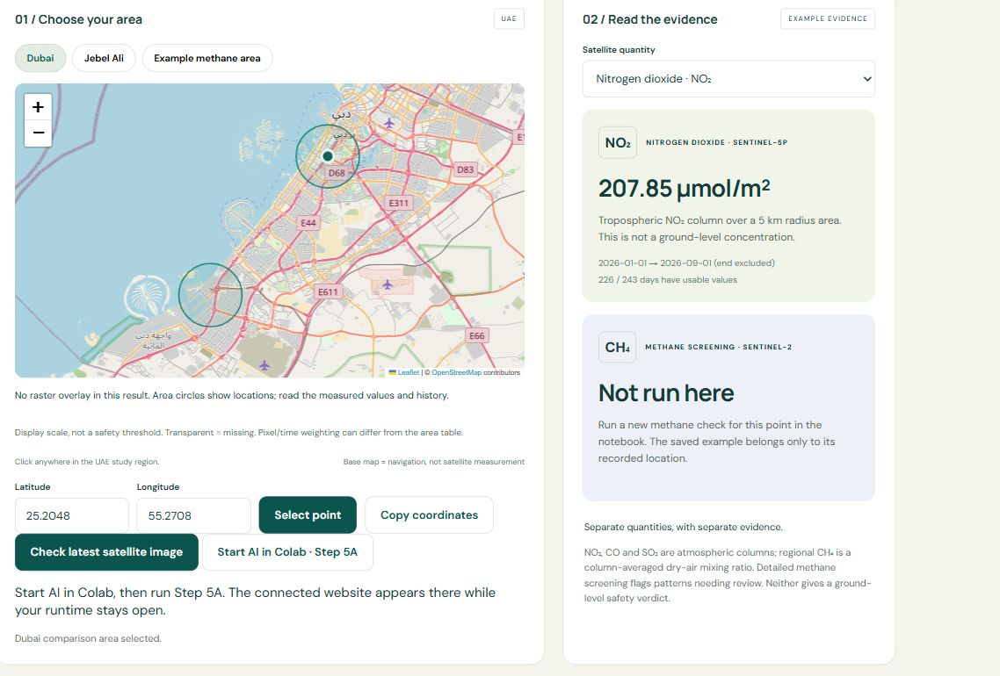

# GeoGuard — Satellite Air Quality Intelligence

Team: GeoGuard · Theme: Air Quality Intelligence · Pilot: UAE

GeoGuard helps environmental monitoring teams prioritize investigation by comparing dated satellite atmospheric measurements and screening detailed imagery for methane-like patterns.

[Presentation PDF](presentation/GeoGuard.pdf) · [Editable slides](presentation/GeoGuard.pptx) · [Website](https://losth6wz.github.io/Geoguard/) · [PoC notebook with visible outputs](PoC.ipynb) · [Interactive Colab](https://colab.research.google.com/github/losth6wz/Geoguard/blob/main/Geoguard.ipynb)

## 1. Business use case

Environmental monitoring and enforcement teams need to decide which areas need closer review or gas-specific field measurements. GeoGuard brings satellite context, observation history and methane image evidence into one map. It supports the review step that otherwise involves consulting separate satellite products and investigation records; it does not make an enforcement decision. The PoC demonstrates that workflow without a ground sensor network or a validated UAE forecast. Commercial use would require appropriate model licences and independent validation.

### Demonstrated investigation workflow

An analyst can select Dubai and NO₂, inspect 207.85 µmol/m² for January–August 2026 with 226/243 usable days, compare Jebel Ali and examine the monthly history. The means demonstrate data access and comparison; unequal coverage and uncertainty do not establish a significant difference or identify a source. Selecting the separate methane example shows the dated 22 September / 9 September comparison, 0 candidate pixels and 96.04% usable coverage. No candidate is not proof of zero methane.

The website’s Download current evidence action saves JSON with the selected location, quantity, matching evidence, dates and an investigation handoff. Records from other locations keep their own coordinates. An unmeasured selection exports an explicit unknown result instead of inheriting another area’s finding. A candidate calls for analyst review and, where warranted, calibrated gas-specific field observations matched to satellite time and footprint.

GeoGuard’s original contribution is the shared evidence workflow: quantity switching keeps units, dates and usable coverage aligned; results retain their locations; reproducible exports connect atmospheric context and experimental image screening to investigation. Copernicus supplies the observations, and UNEP IMEO supplies the pretrained detector. Easier evidence assembly is the proposed benefit; reduced review time, better investigation decisions and user adoption have not yet been measured.

## 2. Problem

Pollution varies across place and time, while individual ground stations cover specific locations and satellite products measure different quantities at different footprints. Missing observations and mixed units can make a combined display misleading. Satellite coverage supplies regional context and repeat observations, while dated, gas-specific displays keep the limits visible. The pilot compares two 5 km circles in Dubai and Jebel Ali and screens one approximately 2 × 2 km UAE area; it does not estimate the prevalence or cost of pollution across the UAE.

## 3. Data used

| Product / provider | Processing and quantity | Bundled observation dates | Terms |
|---|---|---|---|
| Copernicus Sentinel-5P/TROPOMI via Earth Engine, NRTI L3 NO₂ | Tropospheric column, mol/m²; display µmol/m² | 1 Jan to before 1 Sep 2026 | Copernicus Sentinel data terms |
| Sentinel-5P/TROPOMI via Earth Engine, NRTI L3 CO | Total atmospheric column, mol/m²; display mmol/m² | 1 Aug to before 1 Oct 2026 | Copernicus Sentinel data terms |
| Sentinel-5P/TROPOMI via Earth Engine, NRTI L3 SO₂ | Vertical column with assumed ground-level profile, mol/m²; display µmol/m² | 1 Aug to before 1 Oct 2026 | Copernicus Sentinel data terms |
| Sentinel-5P/TROPOMI via Earth Engine, OFFL L3 CH₄ | Albedo-bias-corrected dry-air column mixing ratio, ppb | 1 Aug to before 1 Oct 2026 | Copernicus Sentinel data terms |
| Copernicus Sentinel-2 L1C via public Google archive; CDSE / Earth Search discovery | TOA reflectance; native SWIR 20 m, processing grid 10 m | 22 Sep observation / 9 Sep reference, 2026 | Copernicus Sentinel data terms |
| UNEP IMEO MARS-S2L pretrained model | Methane pattern screening; unchanged hash-pinned checkpoint | Dated screening executed Sep 2026; no training here | Model/data CC BY-NC-SA 4.0; software LGPLv3 |
| CloudSEN12, ISP / University of Valencia | UNetMobV2_V2 cloud/shadow mask, pinned model revision | Mask for each screened observation/reference pair | Weights CC BY-NC 4.0; package LGPLv3 |
| NASA GEOS-FP; optional NOAA GFS via Open-Meteo | Acquisition-time modeled wind, not a gas measurement | Matches scene time; bundled example uses GEOS-FP | NASA/NOAA source terms; Open-Meteo data CC BY 4.0 |

Interactive queries support NRTI/OFFL for NO₂/CO/SO₂; regional CH₄ is OFFL only. Raw exported daily reductions are in [sources/](sources/), with exact collections, bands, dates, coordinates, radius and retrieval scripts. The PoC reads those exports without a live account. Full provider links, revisions and attribution are in [THIRD_PARTY_NOTICES.md](THIRD_PARTY_NOTICES.md). OpenStreetMap/Esri navigation backgrounds are not measurement data.

## 4. Technical approach

1. Read [examples/input.json](examples/input.json) and the actual archived Earth Engine reductions.
2. Use the catalog quality mask; average granules within each UTC day, reduce valid grid cells over 5 km comparison circles, then weight usable daily area values equally in monthly/period means. Missing values stay unknown; valid negative columns ≥ −0.001 mol/m² remain. Fresh interactive radii are 2–20 km.
3. Keep each quantity's native units, dates, usable-day counts and location. Convert NO₂/SO₂ ×1,000,000 and CO ×1,000 for display; CH₄ stays ppb. Map pixels average their own valid days, so map and area-table weighting can differ.
4. Package the dated methane record and figure. Fresh experimental screening checks imagery quality, aligns images, selects a spectrally similar earlier reference from up to three candidates, obtains modeled wind and applies MARS-S2L. Score >0.5 and at least 100 connected processing pixels produce a candidate; the common-valid gate is 95%. These are engineering rules, not validated detection limits.
5. Check numerical parity and export JSON/CSV. The website switches units, history, dates, coverage and available map layers together. Bundled NO₂ has area values/history without a raster overlay; CO/SO₂/regional CH₄ have archived overlays. An arbitrary selected point never inherits another location's result.

## 5. Installation

Tested with Python 3.12.14. Use Python 3.12 and the pinned root requirements for the credential-free PoC; no GPU is required.

```bash
git clone https://github.com/losth6wz/Geoguard.git
cd Geoguard
python -m venv .venv
```

Activate on Windows PowerShell:

```powershell
.\.venv\Scripts\Activate.ps1
```

Or on macOS/Linux:

```bash
source .venv/bin/activate
```

Then:

```bash
python -m pip install -r requirements.txt
```

Optional interactive map and fresh methane inference use separate dependencies:

```bash
python -m pip install -e ".[notebook,methane]" jupyterlab
```

The optional environment is not the pinned submission runner. Fresh atmospheric queries require an Earth Engine account/registered project; fresh methane checks download public imagery and pretrained weights. Colab handles notebook navigation without local JupyterLab installation.

## 6. How to run

```bash
python scripts/run_submission.py
```

This starts a fresh kernel and executes every cell in [PoC.ipynb](PoC.ipynb). No settings need editing for the bundled case. The local Windows verification took about four seconds after dependencies were installed; machine-dependent runtime and installation can differ. It recalculates real atmospheric inputs and replays dated methane evidence, without claiming fresh inference.

Outputs in `outputs/submission/`: `PoC-executed.ipynb`, `result.json`, `no2_summary.csv` and `measurements_summary.csv`. Import `result.json` into the website to inspect them. The run must complete with “Submission complete”. Reproducible numerical values and observation dates stay fixed; export timestamps change.

For fresh results, open [Geoguard.ipynb in Colab](https://colab.research.google.com/github/losth6wz/Geoguard/blob/main/Geoguard.ipynb), run all cells, enter your registered Earth Engine project in Step 3 for atmospheric queries, and use the shared map in Step 5. Step 5A connects the embedded website to methane screening while the runtime stays open. Setup and image downloads may take several minutes; no fixed live-inference runtime is promised. Download evidence/history before ending Colab. Optional repeat checks search for new imagery, not new measurements every 15 minutes.

## 7. Example input and output

[Input settings](examples/input.json) reference [NO₂ raw data](sources/no2_earthengine_export.geojson), [CO/SO₂/CH₄ raw data](sources/measurements_earthengine_export.geojson) and [dated evidence](docs/data/demo.json). Coordinates are Dubai 25.2048, 55.2708 and Jebel Ali 25.0083, 55.0875, both 5 km radius. Numerical [reference results](examples/expected_summary.json), [actual JSON output](examples/result.json) and [executed notebook](examples/PoC-executed.ipynb) are committed.



At 23.86479° N, 53.61893° E, the 22 September 2026 observation against 9 September produced 0 candidate pixels with 96.04% usable coverage. Coverage is not accuracy; no candidate does not prove zero methane. This example is distinct from the atmospheric comparison circles.

Code is in `geoguard/`, `live_detection/` and `guided_colab/`; inputs in `sources/` and `examples/input.json`; committed outputs in `examples/` and `docs/assets/`; new runs in ignored `outputs/`.

## 8. Results and limitations

| Quantity | Dubai mean · usable days | Jebel Ali mean · usable days |
|---|---|---|
| NO₂ · Jan–Aug 2026 | 207.85 µmol/m² · 226/243 | 206.67 µmol/m² · 224/243 |
| CO · Aug–Sep 2026 | 36.33 mmol/m² · 52/61 | 37.70 mmol/m² · 60/61 |
| SO₂ · Aug–Sep 2026 | 145.83 µmol/m² · 60/61 | 143.96 µmol/m² · 60/61 |
| Regional CH₄ · Aug–Sep 2026 | 1966.93 ppb · 33/61 | 1969.56 ppb · 37/61 |

All 30 local software tests passed on 7 October 2026. The PoC ran end to end in the pinned runner environment; GitHub CI also executes it on Ubuntu. Daily/monthly/period parity is checked against actual exports. [Validation evidence](VALIDATION.md) distinguishes these checks from scientific accuracy.

Columns are not surface concentrations, AQI, personal exposure or emission rates. SO₂'s assumed ground-level profile does not make it a surface reading. Regional XCH₄ is distinct from detailed methane scores. Colors are display scales, not health thresholds. The approximately 1.1 km L3 grid is not native instrument resolving power. Unequal valid days, clouds, different footprints, reference uncertainty and wind affect interpretation. Candidates need review; missing imagery remains unknown.

PM, VOC and H₂S instruments are not connected. UAE forecasting, detection accuracy, source attribution and health-safety classifications are not validated. Fresh authenticated Python atmospheric queries were not executed in the audit; the archived retrievals used the equivalent authenticated Earth Engine JavaScript. The public website displays dated evidence; unattended operation requires persistent hosting.



### Proposed validation pilot

One willing environmental monitoring partner, one agreed study area and four weeks after access is arranged form the proposed pilot. Partner participation and data access are not secured. Build independently reviewed positive/no-plume cases plus cloud/surface confounders, freeze the method before evaluation, and hold out dates and locations. Report labeled case counts, precision/recall, false alarms and not-assessable cases where the reference labels support those measures. Extend collection if usable imagery or labels are insufficient; do not infer accuracy from coverage or software tests.

Ask at least three intended users to complete a review/export task. Record completion, time and interpretation errors against their existing workflow, with permission to use anonymized findings. This contact has not happened in the documented evidence. Define numeric detection and false-alarm targets with the partner before evaluation. Advance only when those targets are met, exported evidence is traceable, and all three participants can interpret units, dates and unknown results correctly. [Validation plan and evidence](VALIDATION.md) describes the gates.

## 9. Team, licence and attribution

| Contributor | Contribution |
|---|---|
| Zainab | Pollution sources, pollutant selection, sensing options and interpretation |
| Raseel | Earth Engine satellite mapping and comparison-area contribution |
| Abdulaziz | AI methane screening, evidence/history workflow and integration |

No blanket licence is asserted over team contributions; upstream materials retain their own terms. [THIRD_PARTY_NOTICES.md](THIRD_PARTY_NOTICES.md) records Copernicus, UNEP IMEO MARS-S2L, CloudSEN12, meteorology, map and software attribution. No raw imagery or model weights are committed.
